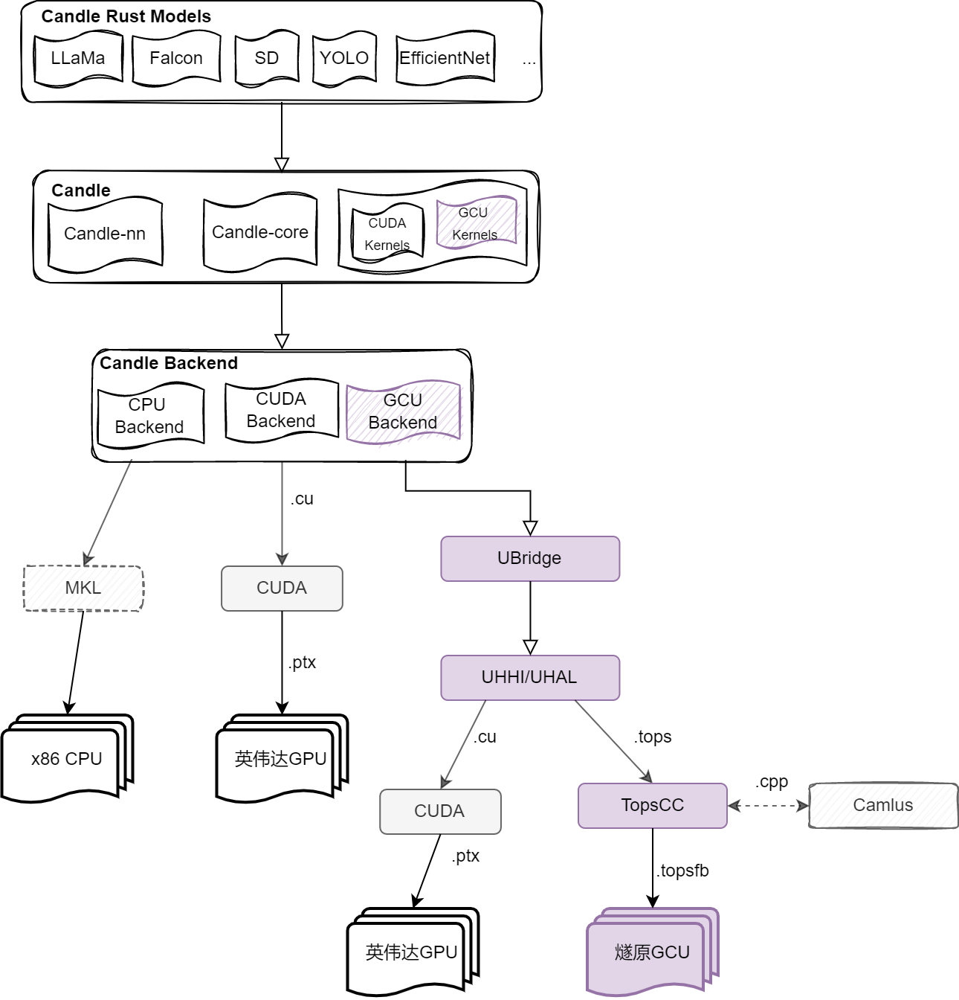
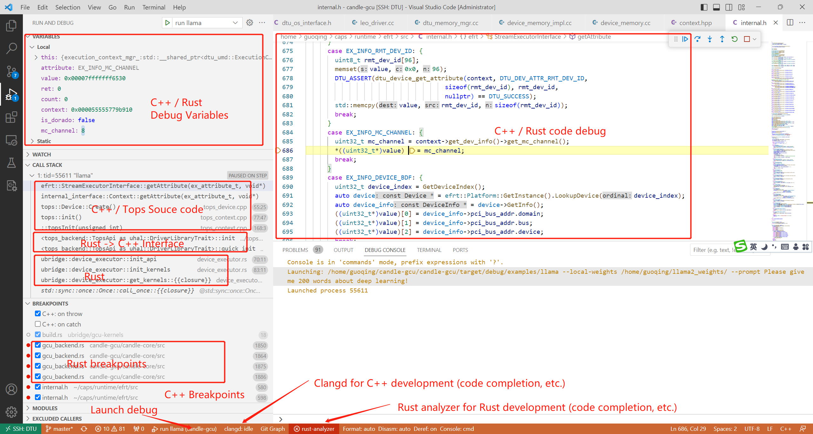

# Candle-GCU
[](https://discord.com/channels/879548962464493619/1136218819447238726)
[](https://crates.io/crates/candle-core)
[](https://docs.rs/candle-core)


Candle-GCU is designed as a compact, high-performance deep learning framework and is meticulously incubated for Language Model Models (LLMs) to prioritize ease of use, compatibility, and the minimization of development and maintenance efforts. Our technical approach is grounded in the foundation laid by the open-source Candle project, spearheaded by Huggingface. Notably, Candle-GCU is developed in Rust, with a deliberate focus on leveraging Enflame GCU capabilities for optimal performance.

At its core, Candle-GCU seeks to synergize with the broader LLM landscape by seamlessly accommodating a multitude of LLMs within the Candle framework. Central to our vision is the pursuit of zero-cost extensions and abstracts, facilitating the seamless integration of the GCU backend into the Candle framework. This adaptation is envisioned to empower all supported LLMs to achieve high-performance execution standards.

In alignment with the roadmap set forth by the Candle community and our project plan, several noteworthy deliverables are anticipated:

1. **Supporting Hundreds of LLMs**: Huggingface stands as the de facto standard and the foremost global repository for LLM resources. Their Transformers library, written in Python, has firmly established itself as a testament to ease of use and portability across an extensive array of state-of-the-art LLM models.

2. **Streamlined Usability**: Candle-GCU aims to minimize development complexities for LLMs. Remarkably, it enables the creation of a LLAMA+LLAMA2 model with a mere 400 lines of code, underscoring its commitment to user-friendly development practices.

3. **Development and Maintenance Simplification**: The Candle design philosophy strategically simplifies the complexities associated with Ahead-of-Time (AOT) operation development. This simplification is achieved through the judicious extraction of shared operations using a micro-kernel mechanism. Drawing inspiration from classical projects like BLIS and contemporary research endeavors such as AMOS and CUTLASS, this approach ensures efficient and maintainable code.

4. **Advanced Roadmap Features**: Looking ahead, the community roadmap envisions a host of advanced features. These include satellite projects like 'candle-transformers,' which serves as a noteworthy alternative to Huggingface's 'Transformers' library. Additionally, 'candle-accelerate,' an auto-parallel framework, is poised to facilitate multi-device and multi-node distributed training with exceptional ease.


## Designed Workflow for supporting Enflame GCU
Candle + GCU Backend -> Ubridge -> UHHI -> GCU Runtime (http://git.enflame.cn/sw/caps)

 

## Develop Status

Currently, candle-gcu supports following models in candle-transformers. Notably, this progress couples with the community works

__TODO: update status with the following template__
| LLM Model ID | LLM Model | Supporting GPU | Supporting Scorpio | Supporting Dorado |
|--|--|--|--|--|
| #1 | LLAMA |✅|✅|x|
| #2 | LLAMA2 |✅|✅|x|
| #3 | Stable Diffusion |✅|x|x|
| #4 | TBD |✅|✅|x| 
| #5 | TBD |✅|✅|x|
| #6 | TBD |✅|✅|x|
| #7 | TBA |✅|✅|x|
| #8 | TBA |✅|✅|x|
| #9 | TBA |✅|✅|x|
| #10 | TBA |✅|✅|x|
| #11 | TBA |✅|✅|x|

## Installation of dependencies 
To bootstrap this project, you should run follow cmd first to fetch all the submodules from its source repos:

Install GCU driver (2.6+), CAPS (0.9+)

Run CAPS installation: driver installation outside docker, and topscc & runtime installation inside docker.

```shell
sudo ./TopsPlatform_0.9.1_deb_amd64.run 
export PATH=$PATH:/opt/tops/bin
```

Install Rust and Cargo

```shell
curl --proto '=https' --tlsv1.2 -sSf https://sh.rustup.rs | sh
```

Update submodules (candle-gcu, ubridge, UHHI)

```shell
git submodule update --init --recursive
```

## $\textcolor{green}{\text{TODO}}$
__Write the following unfinished GCU kernerls defined in Candle (written in TopsCC, refer to candle-kernels)__

**Unary** ✅: $\textcolor{red}{\text{copy}}$, neg, recip, $\textcolor{red}{\text{exp}}$, log, $\textcolor{red}{\text{sin}}$, $\textcolor{red}{\text{cos}}$, abs, $\textcolor{red}{\text{sqr}}$, $\textcolor{red}{\text{sqrt}}$, gelu, relu, elu

**Ternary** ✅: $\textcolor{red}{\text{where}}$

**Reduce** ✅: sum, fast_min, $\textcolor{red}{\text{fast\_max}}$, fast_argmin, fast_argmax, $\textcolor{red}{\text{fast\_sum}}$

**Indexing** ✅: $\textcolor{red}{\text{is}}$, gather, ia, sa

**Fill** ✅: fill

**Conv**: conv1d, conv2d, conv_transpose2d, avg_pool2d, max_pool2d, unsample_nearest2d

**Cast**✅: $\textcolor{red}{\text{cast}}$

**Binary** ✅: $\textcolor{red}{\text{add, div, mul, sub,}}$ minimum, maximum, ne, lt, le, gt, ge

**Affine** ✅: $\textcolor{red}{\text{affine}}$

**GEMM/Matmul/Dot** ✅: $\textcolor{red}{\text{gemm}}$/$\textcolor{red}{\text{matmul}}$/$\textcolor{red}{\text{dot}}$

$\textcolor{green}{\text{Note}}$: $\textcolor{red}{\text{micro-kernels in red for large language models}}$, e.g., llama, chatglm, falcon, etc.

✅: Initial implementation done.

## Sample (LLaMa2 Inference)
Download LLaMa2 weights to a local folder (e.g., THE_WEIGHT_FOLDER), it should contains the following files:

config.json             model-00001-of-00002.safetensors  pytorch_model-00001-of-00002.bin  special_tokens_map.json  tokenizer.model
convert.py              model-00002-of-00002.safetensors  pytorch_model-00002-of-00002.bin  tokenizer_config.json    tosafetensor.py
generation_config.json  pytorch_model.bin.index.json      tokenizer.json

Replace **/home/llama2_weights/** with your weight folder and run the following command on Scorpio:

``` shell
cd candle-gcu
cargo run --release --example llama --features gcu,scorpio -- --local-weights /home/llama2_weights/ --prompt "Please talk about deep learning in 100 words."
```

**Sample inference output (Scorpio X1):**
```
...
loading the model weights from meta-llama/Llama-2-7b-hf
building the model
starting the inference loop
Please talk about deep learning in 100 words.
Deep learning is a subset of machine learning that involves the use of artificial neural networks to model and solve complex problems. It is particularly useful for tasks that require the processing and analysis of large amounts of data, such as image and speech recognition, natural language processing, and autonomous driving. Deep learning algorithms are capable of learning and improving on their own by automatically adjusting their internal parameters during training, allowing them to achieve state-of-the-art performance in a wide range of applications

100 tokens generated (4.502893680088833 token/s)
```

**Currently, the entire workflow can be computed on GCU (i.e., all weights, inputs and outputs buffers were created on GCU). There are 9 types of GCU kernels that have been initially implemented, i.e., affine, binary, cast, matmul, fill, indexing, reduce, ternary and unary, in ubridge/kernels**

**Test candle components** (e.g., mlp, embedding, softmax, rmsnorm, maskfill, attention, etc.) for GCU (Scorpio):

```shell
cd candle-gcu
cargo run --release --example gcutest --features gcu,scorpio -- --local-weights /home/llama2_weights/
```

```
start the candle-gcu testing cases...
Test cache passed!
Test cast passed!
Test embedding passed!
Test softmax passed!
Test rmsnorm passed!
Test maskfill passed!
Test matmul passed!
Test block passed!
Test attention passed!
Test narrow passed!
Test rotary_embedding passed!
```

## End-to-end debuging candle-gcu models + CAPS + GCU kernels (Rust/C++)
Candle-gcu enables end-to-end debuging for Rust and C++ code in a single environment (VS code).

1) Install LLDB debugger (the installer option will prompt during your first view of this project);
   
2) Install clangd for C++ code completion;
   
3) Install rust-analyzer for Rust code completion;
   
4) Build your CAPS project as debug mode;

5) In "UHHI/tops_backend/tops_raw/build.rs", revise the linked library to your CAPS build path;

6) In "candle-gcu/.cargo/config.toml", revise rpath search path to your CAPS build path;

7) Build your debug version of candle-gcu by executing "cargo build --example llama --features gcu";

8) Revise the .vscode/launch.json and set your own weight path (refer resources/weight_path_settings.png);

9)  Navigate to "candle-gcu/candle-examples/examples/llama/main.rs", there is a "debug" option in the main function, click the "debug";

10) Add breakpoints in candle-gcu (candle model or candle-core/gcu-backend/ubridge, etc.) and CAPS source code, e.g., launchkernel.

 

## Get started

### Sample GCU Backend Impl for Candle

For Unary OP

```rust
impl<U: UnaryOpT> Map1 for U {
    fn f<T: DeviceCopy + WithDType>(
        &self,
        src: &GcuSlice<T>,
        dev: &GcuDevice,
        layout: &Layout,
    ) -> Result<GcuSlice<T>> {
        let shape = layout.shape();
        let el_count = shape.elem_count();
        let cfg = GcuLaunchConfig::for_num_elems(el_count as u32);
        let src = &src.slice(layout.start_offset()..);
        let func = dev.get_or_load_func(&kernel_name::<T>(U::KERNEL), ubridge::UNARY)?;
        let out = dev.alloc::<T>(el_count).w()?;
        let params = (el_count, src, &out);
        unsafe { func.launch(cfg, params) }.w()?;
        Ok(out)
    }
}
```

### Sample usage of ubridge

GCU Alloc Function: device alloc (Candle) -> alloc (ubridge) -> DeviceBuffer uninitialized (UHHI) -> CAPS/TopsAPI

``` rust
    pub fn alloc<T: DeviceCopy>(
        self: &Arc<Self>,
        len: usize,
    ) -> DeviceResult<GcuSlice<T>> {
        let device_ptr = if self.is_async {
            unsafe { DeviceBuffer::uninitialized_async(len, &self.stream.unwrap())? }
        } else {
            unsafe { DeviceBuffer::uninitialized(len)? }
        };
        Ok(GcuSlice {
            buffer: device_ptr,
            len,
            device: self.clone(),
            host_buf: None,
        })
    }
```

GCU GEMM Compute with Tuner (fp16)

``` rust
            (GcuStorageSlice::F16(lhs), GcuStorageSlice::F16(rhs)) => {
                let lhs = &lhs.slice(lhs_l.start_offset()..); //slicing left operand
                let rhs = &rhs.slice(rhs_l.start_offset()..); //slicing right operand
                let out = dev.alloc::<f16>(elem_count).w()?; //output buffer
                let bias = dev.alloc::<f16>(n).w()?; //this will be removed later.
                //gemm tuner
                let info = AtenGemmInfo::new(TopsopDataType::TopSopDataFp16, if m==1 {b} else {m}, m, k, n);
                let mut tune = AtenGemmTune::default();
                let tuner = AtenGemmTuner::new();
                tuner.tuner(&info, &mut tune);
                let param = GEMM_OP_PARAS::new(&info, &tune);//tuning results

                let kernel_name = "gemm_f16".to_string();
                let func = dev.get_or_load_func(&kernel_name, ubridge::GEMM)?;

                let cfg = GcuLaunchConfig::for_gemm();
                let params = (lhs, rhs, &out, &bias, //kernel launch params
                    param.input_dtype, b, m, k, n,
                    param.lhs_multicore, param.rhs_multicore, param.batch_multicore,
                    param.lhs_transpose, param.rhs_transpose,
                    param.alpha, param.beta, param.addmm_beta, param.bias,
                    param.sip_m, param.sip_k, param.sip_n
                );
                unsafe { func.launch(cfg, params) }.w()?; //launch kernel compute
                GcuStorageSlice::F16(out) //return results
            }
```

### Sample usage of UHHI

Example of UHAL/UHHI for neural network forward pass (on NVidia GPU & Enflame GCU)

Enflame GCU: Install TopsPlatform 0.8.3+ (Driver, TopsCC, TopsRuntime)

``` rust
//Example of UHAL for neural network forward pass (on NV GPU & Enflame GCU)
use cust_core::DeviceCopy;
use std::collections::HashMap;

//Import UHAL for common computing interfaces

use uhal::error::DeviceResult;
use uhal::launch;
use uhal::memory::DeviceBufferTrait;
use uhal::module::ModuleTrait;
use uhal::stream::{StreamFlags, StreamTrait};
use uhal::DriverLibraryTrait;
//Tops backend
#[cfg(feature = "tops_backend")]
use tops::memory::CopyDestination;
#[cfg(feature = "tops_backend")]
use tops::memory::TopsDeviceBuffer as DeviceBuffer;
#[cfg(feature = "tops_backend")]
use tops::module::TopsModule as Module;
#[cfg(feature = "tops_backend")]
use tops::stream::TopsStream as Stream;
#[cfg(feature = "tops_backend")]
use tops::TopsApi as Api;
#[cfg(feature = "tops_backend")]
use tops_backend as tops;

//Cuda backend
#[cfg(feature = "cuda_backend")]
use cuda::memory::CopyDestination;
#[cfg(feature = "cuda_backend")]
use cuda::memory::CuDeviceBuffer as DeviceBuffer;
#[cfg(feature = "cuda_backend")]
use cuda::module::CuModule as Module;
#[cfg(feature = "cuda_backend")]
use cuda::stream::CuStream as Stream;
#[cfg(feature = "cuda_backend")]
use cuda::CuApi as Api;
#[cfg(feature = "cuda_backend")]
use cuda_backend as cuda;

use crate::device_executor::DeviceExecutor;

fn load_module<'a>(name: &str) -> DeviceResult<Module> {
    #[cfg(not(feature = "scorpio"))]
    #[cfg(feature = "tops_backend")]
    let ptx = format!("{}/kernels/legacy/pavo/{}.topsfb", env!("CARGO_MANIFEST_DIR"), name).to_string();

    #[cfg(feature = "scorpio")]
    let ptx = format!("{}/kernels/legacy/scorpio/{}.topsfb", env!("CARGO_MANIFEST_DIR"), name).to_string();

    #[cfg(feature = "cuda_backend")]
    let ptx = format!("{}/kernels/gpu/{}.ptx", env!("CARGO_MANIFEST_DIR"), name).to_string();

    Module::from_file(&ptx)
}

struct Layer<'a, T: DeviceCopy> {
    op: &'a str,
    weight: Option<&'a DeviceBuffer<T>>,
    input_size: (usize, usize),
    output_size: (usize, usize),
    out_ref: Option<&'a DeviceBuffer<T>>,
}
pub fn get_block_grid(shape1: usize, shape0: usize) -> (usize, usize, usize) {
    let grid_a: usize = (shape1 + 16 - 1) / 16;
    let grid_b: usize = (shape0 + 16 - 1) / 16;
    return (16, grid_a, grid_b);
}

//A 6-layer neural network forward pass
//Unified interface (UHAL) for CUDA and Tops backend
#[allow(non_snake_case)]
pub fn network_test() -> DeviceResult<()> {
    let _device = Api::quick_init(0)?;
    let stream = Stream::new(StreamFlags::NON_BLOCKING, None)?;
    const N: usize = 16;
    const K: usize = 3;
    let w1 = DeviceBuffer::from_slice(&vec![0.01f32; N * N])?;
    let w2 = DeviceBuffer::from_slice(&vec![0.02f32; N * N])?;
    let w3 = DeviceBuffer::from_slice(&vec![0.03f32; N * N])?;
    let w4 = DeviceBuffer::from_slice(&vec![0.04f32; N * N])?;
    let w5 = DeviceBuffer::from_slice(&vec![0.05f32; N * N])?;

    //Neural network layers: matmul(tanh act) -> matmul(relu act) -> matmul(tanh act) -> convolution(3x3 kernel, tanh act) -> matmul(tanh act) -> matmul(leaky act)
    let layers = vec![
        Layer::<f32> {
            op: "batch_matmul_legacy",
            weight: Some(&w1),
            input_size: (N, N),
            output_size: (N, N),
            out_ref: None,
        }, //weight is N x N matric for next layer
        Layer::<f32> {
            op: "tanh",
            weight: None,
            input_size: (N, N),
            output_size: (N, N),
            out_ref: None,
        }, //out N x N
        Layer::<f32> {
            op: "batch_matmul_legacy",
            weight: Some(&w2),
            input_size: (N, N),
            output_size: (N, N),
            out_ref: None,
        }, //weight is N x N matric for next layer
        Layer::<f32> {
            op: "relu",
            weight: None,
            input_size: (N, N),
            output_size: (N, N),
            out_ref: None,
        }, //out N x N
        Layer::<f32> {
            op: "batch_matmul_legacy",
            weight: Some(&w3),
            input_size: (N, N),
            output_size: (N, N),
            out_ref: None,
        }, //weight is convolution kernel for next layer
        Layer::<f32> {
            op: "tanh",
            weight: None,
            input_size: (N, N),
            output_size: (N, N),
            out_ref: None,
        }, //out N x N
        Layer::<f32> {
            op: "convolution",
            weight: Some(&w4),
            input_size: (N, N),
            output_size: (N - K + 1, N - K + 1),
            out_ref: None,
        }, //weight is (N - K + 1) * (N - K + 1) matric for next layer
        Layer::<f32> {
            op: "tanh",
            weight: None,
            input_size: (N - K + 1, N - K + 1),
            output_size: (N - K + 1, N - K + 1),
            out_ref: None,
        }, //out (N - K + 1) x (N - K + 1)
        Layer::<f32> {
            op: "batch_matmul_legacy",
            weight: Some(&w5),
            input_size: (N - K + 1, N - K + 1),
            output_size: (N - K + 1, N - K + 1),
            out_ref: None,
        }, //weight is (N - K + 1) * (N - K + 1) matric for next layer
        Layer::<f32> {
            op: "tanh",
            weight: None,
            input_size: (N - K + 1, N - K + 1),
            output_size: (N - K + 1, N - K + 1),
            out_ref: None,
        }, //output shape (N - K + 1) * (N - K + 1)
        Layer::<f32> {
            op: "batch_matmul_legacy",
            weight: None,
            input_size: (N - K + 1, N - K + 1),
            output_size: (N - K + 1, N - K + 1),
            out_ref: None,
        }, // no weight in the last layer
        Layer::<f32> {
            op: "gelu",
            weight: None,
            input_size: (N - K + 1, N - K + 1),
            output_size: (N - K + 1, N - K + 1),
            out_ref: None,
        }, //output shape (N - K + 1) * (N - K + 1)
    ];
    let mat = vec![0.5f32; N * N];
    let mato = vec![0.0f32; N * N];
    let convo = vec![0.0f32; (N - K + 1) * (N - K + 1)];

    let matA = DeviceBuffer::from_slice(&mat)?;
    let matB = DeviceBuffer::from_slice(&mat)?;
    let matOut = DeviceBuffer::from_slice(&mato)?;
    let matConvOut = DeviceBuffer::from_slice(&convo)?;

    let map_act = HashMap::from([("relu", 0), ("gelu", 1), ("leaky", 2), ("tanh", 3)]);

    let mut out_ref: Option<&DeviceBuffer<f32>> = Some(&matOut);
    let mut matA_ref: Option<&DeviceBuffer<f32>> = Some(&matA);
    let mut matB_ref: Option<&DeviceBuffer<f32>> = Some(&matB);

    let mut out_size: Option<(usize, usize)> = None;
    for layer in layers {
        if ["relu", "gelu", "leaky", "tanh"].contains(&layer.op) {
            let function_name = "activation";
            match load_module(function_name) {
                Ok(module) => {
                    let function_namef32 = "activationf32";
                    let kernel = module.get_function(&function_namef32)?;
                    let param = DeviceBuffer::from_slice(&[
                        (layer.input_size.0 * layer.input_size.1) as i32,
                        map_act[layer.op] as i32,
                    ])?;

                    let (_block_size, _grid_a, _grid_b) =
                        get_block_grid(layer.input_size.1, layer.input_size.0);
                    let A = match matA_ref {Some(a)=> {a}, _=> {panic!("error")}};
                    unsafe {
                        #[cfg(feature = "tops_backend")]
                        let result = launch!(kernel<<<(1, 1, 1), (1, 1, 1), 0, stream>>>(
                            A.as_device_ptr(),
                            param.as_device_ptr(),
                        ));

                        #[cfg(feature = "cuda_backend")]
                        let result = launch!(kernel<<<(grid_a as u32, grid_b as u32), (block_size as u32, block_size as u32), 0, stream>>>(
                            A.as_device_ptr(),
                            layer.input_size.0 as u32,
                            layer.input_size.1 as u32,
                            map_act[layer.op]
                        ));

                        result?;
                    }
                    out_ref = Some(&A);
                    out_size = Some(layer.output_size);
                }
                _ => {
                    panic!("Failed to load kernel!");
                }
            }
        } else if layer.op == "batch_matmul_legacy" {
            match load_module(layer.op) {
                Ok(module) => {
                    let kernel = module.get_function(&layer.op)?;
                    #[cfg(feature = "tops_backend")]
                    let inputShapeA = DeviceBuffer::from_slice(&[
                        1i32,
                        layer.input_size.0 as i32,
                        layer.input_size.1 as i32,
                    ])?;
                    #[cfg(feature = "tops_backend")]
                    let inputShapeB = DeviceBuffer::from_slice(&[
                        1i32,
                        layer.input_size.0 as i32,
                        layer.input_size.1 as i32,
                    ])?;
                    let A = match matA_ref {Some(a)=> {a}, _=> {panic!("error")}};
                    let B = match matB_ref {Some(a)=> {a}, _=> {panic!("error")}};
                    let O = match out_ref {Some(a)=> {a}, _=> {panic!("error")}};

                    unsafe {
                        #[cfg(feature = "tops_backend")]
                        let result = launch!(kernel<<<(1, 1, 1), (1, 1, 1), 0, stream>>>(
                            A.as_device_ptr(),
                            B.as_device_ptr(),
                            O.as_device_ptr(),
                            inputShapeA.as_device_ptr(),
                            inputShapeB.as_device_ptr()
                        ));

                        #[cfg(feature = "cuda_backend")]
                        let result = launch!(kernel<<<(grid_a as u32, grid_b as u32), (block_size as u32, block_size as u32), 0, stream>>>(
                            A.as_device_ptr(),
                            B.as_device_ptr(),
                            O.as_device_ptr(),
                            layer.input_size.0 as u32,
                            layer.input_size.1 as u32,
                            layer.output_size.1 as u32
                        ));

                        result?;
                    }

                    matA_ref = Some(&O);
                    match layer.weight {
                        Some(w) => {
                            matB_ref = Some(w);
                        }
                        _ => {
                        }
                    };

                    out_ref = Some(&O);
                    out_size = Some(layer.output_size);
                }
                _ => {
                    panic!("\nFailed to load kernel (matmul)!");
                }
            }
        } else if layer.op == "convolution" {
            match load_module(layer.op) {
                Ok(module) => {
                    let kernel = module.get_function(&layer.op)?;
                    let A = match matA_ref {Some(a)=> {a}, _=> {panic!("error")}};
                    let B = match matB_ref {Some(a)=> {a}, _=> {panic!("error")}};

                    #[cfg(feature = "tops_backend")]
                    let inputShapeA = DeviceBuffer::from_slice(&[
                        layer.input_size.0 as i32,
                        layer.input_size.1 as i32,
                        1i32,
                        1i32,
                    ])?;
                    #[cfg(feature = "tops_backend")]
                    let inputShapeB = DeviceBuffer::from_slice(&vec![K as i32, K as i32, 1i32, 1i32])?;
                    #[cfg(feature = "tops_backend")]
                    let channelInfo = DeviceBuffer::from_slice(&vec![1i32, 1i32, 1i32, 1i32])?;

                    unsafe {
                        #[cfg(feature = "tops_backend")]
                        let result = launch!(kernel<<<(1, 1, 1), (1, 1, 1), 0, stream>>>(
                            A.as_device_ptr(),
                            B.as_device_ptr(),
                            matConvOut.as_device_ptr(),
                            inputShapeA.as_device_ptr(),
                            inputShapeB.as_device_ptr(),
                            channelInfo.as_device_ptr()
                        ));

                        #[cfg(feature = "cuda_backend")]
                        let result = launch!(kernel<<<(1, 1, 1), (1, 1, 1), 0, stream>>>(
                            A.as_device_ptr(),
                            B.as_device_ptr(),
                            ConvOut.as_device_ptr(),
                            layer.input_size.0 as u32,
                            layer.input_size.1 as u32,
                            K as u32,
                            K as u32
                        ));

                        result?;
                    }
                    matA_ref = Some(&matConvOut);
                    match layer.weight {
                        Some(w) => {
                            matB_ref = Some(w);
                        }
                        _ => {
                        }
                    };
                    out_ref = Some(&matConvOut);
                    out_size = Some(layer.output_size);
                }
                _ => {
                    panic!("\nFailed to load kernel (convolution)!");
                }
            }
        } else {
            panic!("Operation {} not supported!", layer.op);
        }
    }
    // Wait asynchronous kernels to finish.
    stream.synchronize()?;

    match out_ref {
        Some(out) => {
            let mut out_host = vec![0.0f32; out.len()];
            out.copy_to(&mut out_host)?;
            match out_size {
                Some(sz) => {
                    let W = sz.0;
                    let H = sz.1;
                    println!("\n\nResults of forward pass******************");
                    for x in 0..H {
                        for y in 0..W {
                            print!("{:.5} ", out_host[x * W + y]);
                        }
                        println!("{}", "");
                    }
                }
                _ => {
                    panic!("Unable to obtain compute result!")
                }
            }
        }
        _ => {
            panic!("Unable to obtain compute result!")
        }
    }

    println!("\nLaunched compute kernel successfully.");

    Ok(())
}
```

### Sample of UnaryOp kernel for candle-gcu

``` c++
#include <stdio.h>
#include <tops.h>
#include <tops/topsrtc.h>
#include <tops/half.h>
#include <tops/bfloat.h>
#include <tops/tops_runtime.h>
#include <krt/scalar.h>
#include <krt/vector_mask.h>
#include <krt/dispatch.h>
#include <krt/leaptr.h>
#include <krt/vector_infra.h>
#include "include/common/atomic_op.h"
#include "utils.h"
using namespace std;
using namespace tops;

enum UNARY_TYPE {
    UNARY_TYPE_NEG = 1,
    UNARY_TYPE_EXP = 2,
    UNARY_TYPE_LOG = 3,
    UNARY_TYPE_SIN = 4,
    UNARY_TYPE_COS = 5,
    UNARY_TYPE_ABS = 6,
    UNARY_TYPE_SQUARE = 8,
    UNARY_TYPE_SQRT = 9,
    UNARY_TYPE_RSQRT = 10,
    UNARY_TYPE_GELU = 11,
    UNARY_TYPE_RELU = 12,
    UNARY_TYPE_ELU = 13,
    UNARY_TYPE_SILU = 14,
    UNARY_TYPE_TANH = 15,
    UNARY_TYPE_RECIP = 16,
    UNARY_TYPE_COPY = 20,
};

template <typename T>
__device__ void gelu_kernel(T* output, T* input, int num) {
  using vtype = typename scalar_to_vector<T,
                                          TOPS_VECTOR_LENGTH>::type;
  const int vlength = vector_length<vtype>::value;
  leaptr<vtype> intput_ptr = simple_leaptr<vtype>(input);
  leaptr<vtype> output_ptr = simple_leaptr<vtype>(output);
  int group_num = (num + vlength - 1) / vlength;
  vtype v_input, v_output;
  for (int i = 0; i < group_num; i++) {
    v_input = intput_ptr.load();
    v_output = vgelu(v_input);
    output_ptr.store(v_output);
  }
}

template <typename T, typename VT>
__device__ __forceinline__ void unary_atomic(T* in, T* out, int len, UNARY_TYPE tp)
{
  tops_dte_ctx_t ctx;
  ctx.init();
  switch (tp) {
    case UNARY_TYPE_NEG:
      {
        neg(out, in, len);
        break;
      }
    case UNARY_TYPE_EXP:
      {
        exp(out, in, len);
        break;
      }
    case UNARY_TYPE_LOG:
      {
        log(out, in, len);
        break;
      }
    case UNARY_TYPE_SIN:
      {
        sin(out, in, len);
        break;
      }
    case UNARY_TYPE_COS:
      {
        cos(out, in, len);
        break;
      }
    case UNARY_TYPE_ABS:
      {
        abs(out, in, len);
        break;
      }
    case UNARY_TYPE_SQUARE:
      {
        mul(out, in, in, len);
        break;
      }
    case UNARY_TYPE_SQRT:
      {
        sqrt(out, in, len);
        break;
      }
    case UNARY_TYPE_RSQRT:
      {
        rsqrt(out, in, len);
        break;
      }
    case UNARY_TYPE_GELU:
      {
        gelu_kernel(out, in, len);
        break;
      }
    case UNARY_TYPE_RELU:
      {
        relu_kernel<T, VT>(out, in , len);
        break;
      }
    case UNARY_TYPE_ELU:
      {
        // elu(out, in, len); todo!()
        break;
      }
    case UNARY_TYPE_SILU:
      {
        //(out, in, len); todo!()
        break;
      }
    case UNARY_TYPE_TANH:
      {
        tanh(out, in, len);
        break;
      }
    case UNARY_TYPE_RECIP:
      {
        reciprocal(out, in, len);
        break;
      }
    case UNARY_TYPE_COPY:
      {
        tops::mdspan src_p(tops::Private, in, len);
        tops::mdspan dst_p(tops::Private, out, len);
        tops::memcpy(ctx, dst_p, src_p);
        break;
      }
    default:
      break;
    }
}

#define tile_size 0x8000
#define PING_PONG_SIZE 2

template <typename T, typename VT>
__device__ void unary_kernel(T* in, T* out, int len, UNARY_TYPE tp) {
  tops_dte_ctx_t ctxs_in[PING_PONG_SIZE];
  tops_dte_ctx_t ctxs_out[PING_PONG_SIZE];
  tops::event evs_in[PING_PONG_SIZE];
  tops::event evs_out[PING_PONG_SIZE];
  __local__ __valigned__ T in_buffer[PING_PONG_SIZE][tile_size];
  __local__ __valigned__ T out_buffer[PING_PONG_SIZE][tile_size];
  int N = len;
  tops::mdspan output(tops::Global, out, N);

  int thread_num = GetThreadNum();
  int thread_id = GetThreadIdx();

  int thread_off_leading = thread_id * tile_size;
  int thread_len_leading =
      N - thread_off_leading >= tile_size ? tile_size : N - thread_off_leading;
  int thread_step = tile_size * thread_num;

  int thread_off_leading_next = thread_off_leading + thread_step;
  int thread_remain_leading = N - thread_off_leading_next;
  int thread_len_leading_next =
      thread_remain_leading >= tile_size ? tile_size : thread_remain_leading;

  int pp_flag = 0;
  tops::dte_scope s_in0(ctxs_in[0]);
  tops::dte_scope s_in1(ctxs_in[1]);
  tops::dte_scope s_out0(ctxs_out[0]);
  tops::dte_scope s_out1(ctxs_out[1]);

  // first config pingpong dma completely: d2s/s2d, linear copy
  if (thread_len_leading > 0) {
    ctxs_in[0].config_memcpy(
        tops::mdspan(tops::Private, in_buffer[pp_flag], thread_len_leading),
        tops::mdspan(tops::Global, in + thread_off_leading,
                     thread_len_leading));

    ctxs_out[0].config_memcpy(
        tops::mdspan(tops::Global, out + thread_off_leading,
                     thread_len_leading),
        tops::mdspan(tops::Private, out_buffer[pp_flag], thread_len_leading));

    evs_in[pp_flag] = ctxs_in[pp_flag].trigger();
  }

  if (thread_len_leading_next > 0) {
    ctxs_in[1].config_memcpy(
        tops::mdspan(tops::Private, in_buffer[1],
                     thread_len_leading_next),
        tops::mdspan(tops::Global, in + thread_off_leading_next,
                     thread_len_leading_next));

    ctxs_out[1].config_memcpy(
        tops::mdspan(tops::Global, out + thread_off_leading_next,
                     thread_len_leading_next),
        tops::mdspan(tops::Private, out_buffer[1],
                     thread_len_leading_next));
  }

  for (int i = thread_off_leading; i < N; i += thread_step) {
    int pp_flag_next = 1 - pp_flag;
    int pp_flag_prev = 1 - pp_flag;
    int thread_off_next = i + thread_step;
    int thread_remain_next = N - thread_off_next;
    int thread_len = N - i >= tile_size ? tile_size : N - i;
    int thread_len_next =
        thread_remain_next >= tile_size ? tile_size : thread_remain_next;
    if (thread_len_next > 0) {
      evs_in[pp_flag_next] = ctxs_in[pp_flag_next].trigger();
    }

    int thread_off_next2 = i + thread_step * 2;
    int thread_remain_next2 = N - thread_off_next2;
    int thread_len_next2 =
        thread_remain_next2 >= tile_size ? tile_size : thread_remain_next2;

    if (thread_len > 0) {
      evs_in[pp_flag].wait();
    }

    if (thread_len_next2 > 0) {
      ctxs_in[pp_flag].config_memcpy(
        tops::mdspan(tops::Private, in_buffer[pp_flag],
                     thread_len_next2),
        tops::mdspan(tops::Global, in + thread_off_next2,
                     thread_len_next2));
    }

    // call atomic op here
    if (thread_len > 0) {
      unary_atomic<T, VT>(in_buffer[pp_flag], out_buffer[pp_flag],
                               thread_len, tp);
      evs_out[pp_flag] = ctxs_out[pp_flag].trigger();
    }

    if (i != thread_off_leading) {
      int thread_off_prev = i - thread_step;
      int thread_remain_prev = N - thread_off_prev;
      int thread_len_prev =
          thread_remain_prev >= tile_size ? tile_size : thread_remain_prev;
      if (thread_len_prev > 0) {
        evs_out[pp_flag_prev].wait();
      }

      if (thread_len_next > 0) {
        ctxs_out[pp_flag_prev].config_memcpy(
        tops::mdspan(tops::Global, out + thread_off_next,
                     thread_len_next),
        tops::mdspan(tops::Private, out_buffer[pp_flag_prev],
                     thread_len_next));
      }
    }
    pp_flag = 1 - pp_flag;
  }

  if (thread_len_leading > 0) {
    evs_out[1 - pp_flag].wait();
  }
}

#define UNARY_OP(TYPE, VT, FN_NAME, TP) \
extern "C" __global__ void FN_NAME( \
    const size_t numel, \
    TYPE *inp, \
    TYPE *out) \
{ \
    unary_kernel<TYPE, VT>(inp, out, numel, TP); \
} \

UNARY_OP(__bf16, vbfloat, uneg_bf16, UNARY_TYPE_NEG)
UNARY_OP(__bf16, vbfloat, uexp_bf16, UNARY_TYPE_EXP)
UNARY_OP(__bf16, vbfloat, ulog_bf16, UNARY_TYPE_LOG)
UNARY_OP(__bf16, vbfloat, usin_bf16, UNARY_TYPE_SIN)
UNARY_OP(__bf16, vbfloat, ucos_bf16, UNARY_TYPE_COS)
UNARY_OP(__bf16, vbfloat, uabs_bf16, UNARY_TYPE_ABS)
UNARY_OP(__bf16, vbfloat, usqr_bf16, UNARY_TYPE_SQUARE)
UNARY_OP(__bf16, vbfloat, usqrt_bf16, UNARY_TYPE_SQRT)
UNARY_OP(__bf16, vbfloat, ursqrt_bf16, UNARY_TYPE_RSQRT)
UNARY_OP(__bf16, vbfloat, ugelu_bf16, UNARY_TYPE_GELU)
UNARY_OP(__bf16, vbfloat, urelu_bf16, UNARY_TYPE_RELU) 
UNARY_OP(__bf16, vbfloat, usilu_bf16, UNARY_TYPE_SILU) 
UNARY_OP(__bf16, vbfloat, utanh_bf16, UNARY_TYPE_TANH) 
UNARY_OP(__bf16, vbfloat, urecip_bf16, UNARY_TYPE_RECIP) 
UNARY_OP(__bf16, vbfloat, ucopy_bf16, UNARY_TYPE_COPY) 
UNARY_OP(__bf16, vbfloat, uelu_bf16, UNARY_TYPE_ELU) 

UNARY_OP(__fp16, vhalf, uneg_f16, UNARY_TYPE_NEG)
UNARY_OP(__fp16, vhalf, uexp_f16, UNARY_TYPE_EXP)
UNARY_OP(__fp16, vhalf, ulog_f16, UNARY_TYPE_LOG)
UNARY_OP(__fp16, vhalf, usin_f16, UNARY_TYPE_SIN)
UNARY_OP(__fp16, vhalf, ucos_f16, UNARY_TYPE_COS)
UNARY_OP(__fp16, vhalf, uabs_f16, UNARY_TYPE_ABS)
UNARY_OP(__fp16, vhalf, usqr_f16, UNARY_TYPE_SQUARE)
UNARY_OP(__fp16, vhalf, usqrt_f16, UNARY_TYPE_SQRT)
UNARY_OP(__fp16, vhalf, ursqrt_f16, UNARY_TYPE_RSQRT)
UNARY_OP(__fp16, vhalf, ugelu_f16, UNARY_TYPE_GELU)
UNARY_OP(__fp16, vhalf, urelu_f16, UNARY_TYPE_RELU)
UNARY_OP(__fp16, vhalf, usilu_f16, UNARY_TYPE_SILU)
UNARY_OP(__fp16, vhalf, utanh_f16, UNARY_TYPE_TANH)
UNARY_OP(__fp16, vhalf, urecip_f16, UNARY_TYPE_RECIP)
UNARY_OP(__fp16, vhalf, ucopy_f16, UNARY_TYPE_COPY)
UNARY_OP(__fp16, vhalf, uelu_f16, UNARY_TYPE_ELU)


UNARY_OP(float, vfloat, uneg_f32, UNARY_TYPE_NEG)
UNARY_OP(float, vfloat, uexp_f32, UNARY_TYPE_EXP)
UNARY_OP(float, vfloat, ulog_f32, UNARY_TYPE_LOG)
UNARY_OP(float, vfloat, usin_f32, UNARY_TYPE_SIN)
UNARY_OP(float, vfloat, ucos_f32, UNARY_TYPE_COS)
UNARY_OP(float, vfloat, uabs_f32, UNARY_TYPE_ABS)
UNARY_OP(float, vfloat, usqr_f32, UNARY_TYPE_SQUARE)
UNARY_OP(float, vfloat, usqrt_f32, UNARY_TYPE_SQRT)
UNARY_OP(float, vfloat, ursqrt_f32, UNARY_TYPE_RSQRT)
UNARY_OP(float, vfloat, ugelu_f32, UNARY_TYPE_GELU)
UNARY_OP(float, vfloat, urelu_f32, UNARY_TYPE_RELU)
UNARY_OP(float, vfloat, usilu_f32, UNARY_TYPE_SILU)
UNARY_OP(float, vfloat, utanh_f32, UNARY_TYPE_TANH)
UNARY_OP(float, vfloat, urecip_f32, UNARY_TYPE_RECIP)
UNARY_OP(float, vfloat, ucopy_f32, UNARY_TYPE_COPY)
UNARY_OP(float, vfloat, uelu_f32, UNARY_TYPE_ELU)
```

### Sample of Dot/Matmul kernel (TopsCC + Intrinsics) for cangle-gcu

``` c++
//m can be any size, k is divisible by tile_size
template <typename T, typename VT, FP dot_intrinsic>
__device__ void dot(
  T *lhs,
  T *rhs,
  T *out,
  int m,
  int k,
  int n) {
  constexpr int vlen = tops::hvlength<VT>();
  constexpr int tile_size = 1 * vlen;

  int blockId = blockIdx.y * gridDim.x + blockIdx.x;
  int threadId = blockId * blockDim.x + threadIdx.x;

  int lstride = tile_size;
  if (m < tile_size) { //for small m
    lstride = m;
  }

  int blockIndex = threadId / (n / tile_size);
  int threadIndex = threadId % (n / tile_size);
//   printf("blockIndex %d, threadIndex %d", blockIndex, threadIndex);

  __valigned__ T lhs_l1[lstride * tile_size];
  __valigned__ T rhs_l1[tile_size * tile_size];

  __valigned__ T out_l1[lstride * tile_size];
  __valigned__ T temp[lstride * tile_size];

  tops::mdspan out_l1_(out_l1, lstride, tile_size);

  tops::mdspan srcl_l1(lhs_l1, lstride, tile_size);
  tops::mdspan srcr_l1(rhs_l1, tile_size, tile_size);

  tops::mdspan srcl_l3(lhs, m, k);
  tops::mdspan srcr_l3(rhs, k, n);
  tops::mdspan dst_l3(out, m, n);

  tops_dte_ctx_t ctx;   //L1-L3
  tops::dte_scope s(ctx);

  int idx_y = blockIndex * lstride;
  int idx_x = threadIndex * tile_size;

  if (idx_y < m) { //parallel
    int offsets_l[] = {idx_y, 0};
    if (idx_x < n) { //parallel
      tops::memset<T>(ctx, out_l1_, T(0)); //accumulation buffer
      tops::mdspan dst_l1(out_l1, lstride, tile_size);
      int offsets_r[] = {0, idx_x};

      for (int i = 0; i < k/tile_size; i++) { //k must be divisible by tile_size
        offsets_l[1] = i * tile_size;
        tops::slice(ctx, srcl_l1, srcl_l3, offsets_l); //slicing the left operand
        offsets_r[0] = i * tile_size;
        tops::slice(ctx, srcr_l1, srcr_l3, offsets_r);  //slicing the right operand
        // //dot_no_transpose
        auto lhs_address = (__attribute__((address_space(5))) T *)(lhs_l1);
        auto rhs_address = (__attribute__((address_space(5))) T *)(rhs_l1);
        auto out_address = (__attribute__((address_space(5))) T *)(temp);

        //call intrinsic core (two pieces of buffers, compute on L1)
        dot_intrinsic(reinterpret_cast<long long>(lhs_address),
                       reinterpret_cast<long long>(rhs_address),
                       reinterpret_cast<long long>(out_address),
                       lstride, //lstride can be any size <= tile_size
                       tile_size,
                       tile_size,
                       0,
                       1);

        for (auto i = 0; i < lstride * tile_size; i++) { //result accumulation
          out_l1[i] += temp[i];
        }
      }
      //L1->L3
      int offsets_o[] = {idx_y, idx_x};
      tops::deslice(ctx, dst_l3, dst_l1, offsets_o); //back to output buffer
    } 
  } 
}


extern "C" __global__ void dotllm_f16(const size_t m, const size_t k, const size_t n, tops::half *matA, tops::half *matB, tops::half* out)
{
    dot<tops::half, vhalf, kernel_dot_m_le256_fp16>(matA, matB, out, m, k, n);

}

```